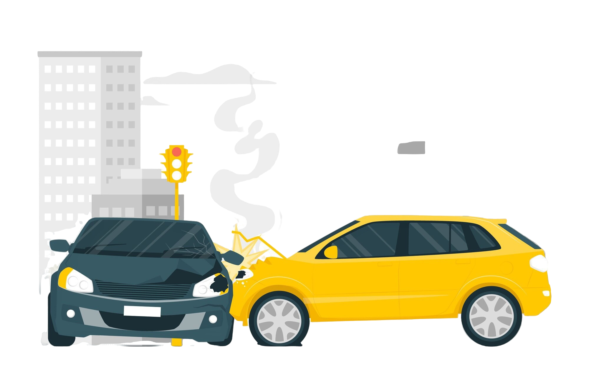
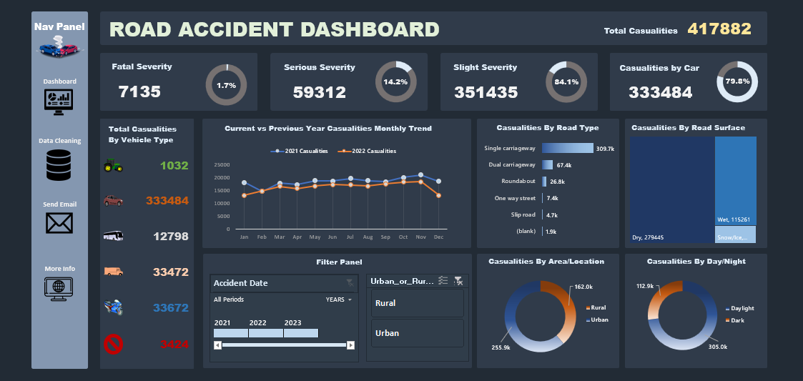

# Road Accident Data Analysis And Interactive Dashboard With MS Excel

 

### Project Description

This project involves creating a dynamic Road Accident Dashboard using Excel to analyze and visualize key metrics related to road accidents for the years 2021 and 2022. The dashboard will provide actionable insights to stakeholders such as the Ministry of Transport, Police Force, Emergency Services, and others, focusing on accident severity, vehicle types, and road conditions.

 

### Dataset Overview

- **Source**: [Road Accident Dataset](https://docs.google.com/spreadsheets/d/1y1cXn8qZIZGwWxbHPojfQndpdNcdXweZ/edit?usp=sharing&ouid=100554781607807743501&rtpof=true&sd=true)
- **Total Rows**: 307,974
- **Column include**: Accident Index, Accident Date, Day of Week, Junction Control, Junction Detail, Accident Severity, Latitude, Light Conditions, Local Authority (District), Carriageway Hazards, Longitude, Number of Casualties, Number of Vehicles, Police Force, Road Surface Conditions, Road Type, Speed_limit, Time,Urban or Rural Area, Weather Conditions, Vehicle Type.

 

### Project Goals

#### Business Requirements
The client requested an interactive dashboard that includes the following insights:
- Primary KPI's - Total casualties  taken place after the accident
- Primary KPI's - Total casualties & percentage of total with respect to accident severity and maximum casulties by type of vehicle
- Secondary KPI's - Total casualties with respect to vehicle type
- Monthly trend showing comparison of casualties for current year and previous year
- Maximum casualties by Road Type
- Distribution of total casualties by Road Surface
- Relation between Casualties by Area/ Location & by Day/Night

#### The Stakeholders
- Ministry of Transport
- Road Transport Department
- Police Force
- Emergency Service Department
- Road Safety Corps
- Transport Operators
- Traffic Management Agencies
- Public
- Media

 

### Steps to Complete the Project
#### 1. Data Cleaning
- Remove Duplicates
- General Standardization

#### 2. Data Analysis
- Calculate total casualties and percentages by severity and vehicle type.
- Analyze trends comparing 2021 and 2022.
- Identify maximum casualties by road type and surface condition.
- Casualties by Area/Location & by Day/Night.
- View Analysis: [Road Accident Analysis](https://docs.google.com/spreadsheets/d/1RmOgiJgMacvBl_bbB4b0ljBx6WzHXC6j/edit?usp=sharing&ouid=100554781607807743501&rtpof=true&sd=true)

#### 3. Visualization and Dashboard

- Create an interactive dashboard showcasing all insights.
- Combine visualizations into a single dashboard for stakeholders:
  - Doughnut chart showing the severity rate, Casualities by Area/Location and Light Conditions
  - Casualties by Vehicle Types
  - Monthly Trends: Line chart comparing casualties for 2021 and 2022.
  - Bar Chart for casualties by Road Type and Treemap for casualities by Road Surface

View Dashboard Image here: [Dashboard Image](https://drive.google.com/file/d/1RAQYHndrNr1_FLcdHYsKvdQh0drELTS3/view?usp=sharing) 
and Interactive Dashboard: [Road Accident Dashboard](https://docs.google.com/spreadsheets/d/1DtI5YA5ux77RReXSQo246VHGcZ59UErs/edit?usp=sharing&ouid=100554781607807743501&rtpof=true&sd=true)

 
